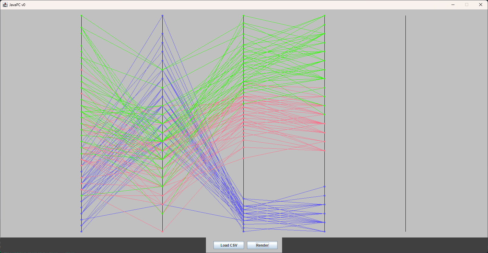
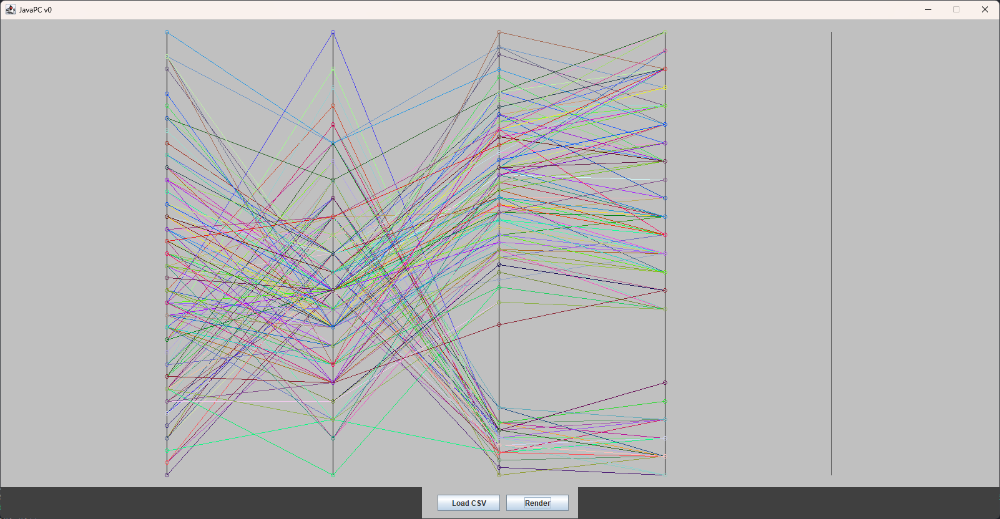
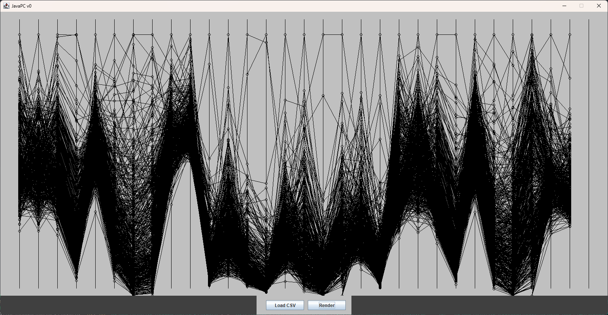
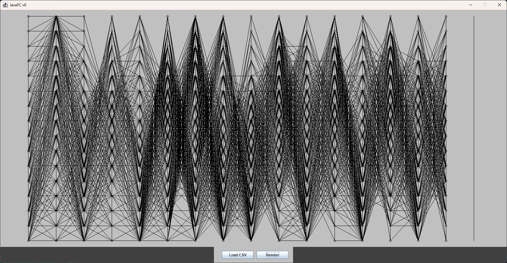

# JavaPC

This program is for viewing a multidimensional (n-D) dataset in a parallel coordinates (PC) plot.  
The implementation language is in Java and without any external dependencies.  

Parsed CSV files must have class/id in the lass column for now.  

## How to use

To plot a dataset make sure the class/id column is the last column.  
- Start program with Java by running `JavaPC/Main.java`  
- Click 'Load CSV', pick your file  
- Click 'Render Plot'  

## Datasets

- `iris.csv` - Fisher's Iris flower classification dataaset. Classes: Virginica, Versicolor, Setosa  
- `mnist_letters.csv` - MNIST's capital letter dimensions of handwriting dataset. Classes: Capital letters A - Z  
- `wbc_diag.csv` - Wisconsin breast cancer diagnosis dataset. Classes: Maglignant, Benign  

## Project Goals

- last axis plot for class/id   
- axis name and range labels  
- move dataset processing to preprocssing step on dataset load  
- dataset class abstraction to store mins, maxes, names, classCount  
- detect class/id column on dataset load  
- other dataset formats (.txt, .pdf?)
- axis inversion  
- hyperblock outlines  
- nD datapoint highlighting  

## Early screenshots

### Iris dataset with class specific colors:  

### Iris dataset with random colors:  

### first wbc diagnosis dataset render:  

### first mnist letters dataset render:  

