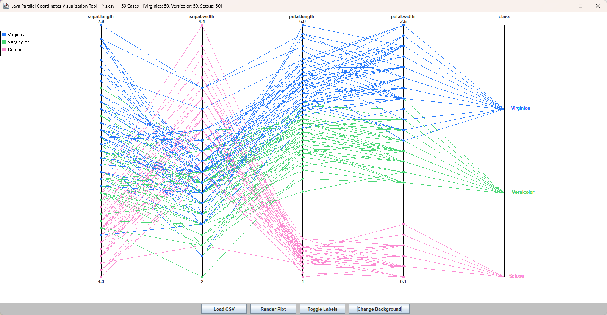
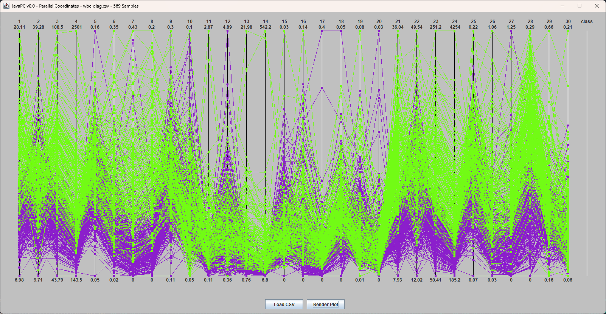
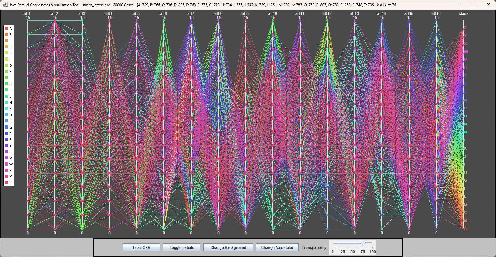

# Java Parallel Coordinates Visualization Tool

Java Parallel Coordinates Visualization Tool, visualizing multidimensional/multivariate CSV data with Java Swing. 

## Prerequisites

Make sure Java is installed on your system to compile and run this application.

## How to Compile and Run

To get started, open a command line interface (CLI) and navigate to your project directory. Run the following commands:

```bash
# Compile all Java files in the javaPC directory
javac javaPC/*.java

# Run the main Driver class
java javaPC.Driver
```

## How to Compile

```bash
jar cvfm Parallel-Coordinates-Vis.jar manifest.txt javaPC/*.class
```

## How to Use

To plot a dataset make sure the class/id column is the last column.  

- Start program with Java by running `JavaPC/Main.java`
- Click 'Load CSV', pick your file
- Click 'Render Plot'

## Datasets

- `breast-cancer-wisconsin.csv` - UCI's Wisconsin breast cancer dataset with 30 features. Classes: Malignant, Benign
- `breast-cancer-wisconsin-9f.csv` - UCI's Wisconsin breast cancer dataset with 9 features. Classes: Malignant, Benign
- `diabetes.csv` - UCI's diabetes dataset. Classes: 0, 1  
- `fisher_iris_SVe.csv` - Subset of Fisher's Iris dataset for Versicolor and Setosa. Classes: Versicolor, Setosa
- `heart.csv` - UCI's heart disease dataset. Classes: 0, 1  
- `ionosphere.csv` - Dataset of radar data. Classes: Good, Bad
- `iris.csv` - Fisher's Iris flower classification dataset. Classes: Virginica, Versicolor, Setosa
- `iris_S_vs_VW.csv` - Subset of Fisher's Iris dataset for Setosa vs. others. Classes: Setosa, Other
- `iris_setosa.csv` - Subset of Fisher's Iris dataset, only Setosa class. Classes: Setosa
- `iris_SVe_vs_Vi.csv` - Subset of Fisher's Iris dataset, comparing Setosa/Versicolor against Virginica. Classes: Setosa/Versicolor, Virginica
- `iris_SVi_vs_Ve.csv` - Subset of Fisher's Iris dataset, comparing Setosa/Virginica against Versicolor. Classes: Setosa/Virginica, Versicolor
- `iris_V_vs_V.csv` - Subset of Fisher's Iris dataset, comparing Virginica against others. Classes: Virginica, Other
- `mnist_letters.csv` - MNIST's capital letter dimensions of handwriting dataset. Classes: Capital letters A - Z  
- `sin_cos.csv` - Dataset containing sin and cos values for various angles. Classes: Sin, Cos
- `wbc_diag.csv` - Wisconsin breast cancer diagnosis dataset (basic version). Classes: Malignant, Benign
- `wheat_seeds.csv` - UCI's wheat seeds dataset. Classes: 0, 1, 2  
- `wine.csv` - Dataset with chemical analysis of wines. Classes: Class_0, Class_1, Class_2

## Screenshots

### Iris dataset render  



### Wisconsin breast cancer diagnosis render  



### MNIST render  


