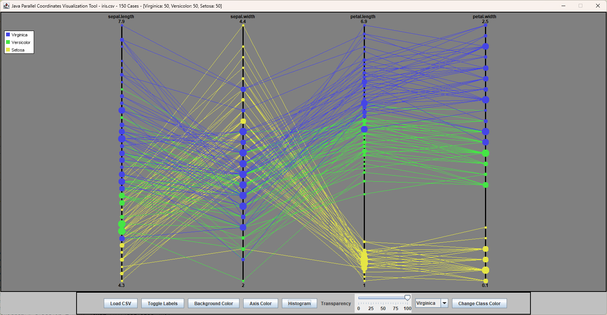
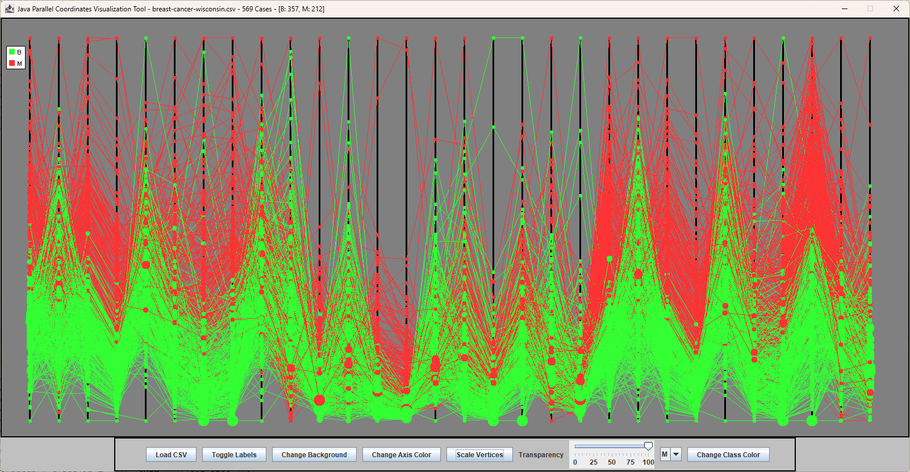

# Java Parallel Coordinates Visualization Tool

Java Parallel Coordinates Visualization Tool, Java-Parallel-Coordinates-Vis, is a pre-compiled and opensource Java Swing GUI application. This application visualizes multidimensional/multivariate CSV data with the Java Swing GUI library for cross-platform support dependent on JVM/Swing/AWT toolkit support.

## What are Parallel Coordinates

"Parallel Coordinates plots are a common method of visualizing high-dimensional datasets to analyze multivariate data having multiple variables, or attributes." [Wikipedia](https://en.wikipedia.org/wiki/Parallel_coordinates)

## Screenshots

### Iris dataset render  



### Heart disease dataset render


### Wisconsin breast cancer diagnosis render  



### MNIST render  


## Prerequisites

Make sure Java is installed on your system to compile and run this application.

## How to Compile

To get started, open a command line interface (CLI) and navigate to your project directory. Run the following commands:

```bash
# Compile all Java files in the javaPC directory
javac javaPC/*.java
```

## How to Run

```bash
# Run the main Driver class
java javaPC.Driver
```

## How to Build the Jar

```bash
jar cvfm Parallel-Coordinates-Vis.jar manifest.txt javaPC/*.class
```

## Makefile Script

The Makefile in this project simplifies the process of compiling Java files and building the JAR file. Below are the provided recipes:

- **Compile Java Files and Build the JAR**: This single command compiles all `.java` files within the `javaPC` directory and packages the compiled `.class` files into a JAR file, including the specified manifest.

  ```bash
  make
  ```

- **Clean**: Removes all compiled .class files and the generated JAR file to clean the project directory.

  ```bash
  make clean
  ```

## How to Use

To plot a dataset make sure the class/id column is the last column.  

- Start program with Java by running `JavaPC/Main.java` or by running the compiled JAR file.
- Click 'Load CSV' to open the file picker and select a dataset to visualize.
- Click 'Render Plot', rerendering the plot will generate a new color scheme if preferred.
- Click 'Toggle Labels', to toggle on/off the visibility of class, attribute, and ranges.
- Click 'Histogram', to toggle on/off histogram correlated density sized vertices.

## Datasets

- `breast-cancer-wisconsin.csv` - UCI's Wisconsin breast cancer dataset with 30 features. Classes: Malignant, Benign
- `breast-cancer-wisconsin-9f.csv` - UCI's Wisconsin breast cancer dataset with 9 features. Classes: Malignant, Benign
- `diabetes.csv` - UCI's diabetes dataset. Classes: Negative, Positive
- `fisher_iris_SVe.csv` - Subset of Fisher's Iris dataset for Versicolor and Setosa. Classes: Versicolor, Setosa
- `heart.csv` - UCI's heart disease dataset. Classes: Absence, Presence
- `ionosphere.csv` - Dataset of radar data. Classes: Good, Bad
- `iris.csv` - Fisher's Iris flower classification dataset. Classes: Virginica, Versicolor, Setosa
- `iris_S_vs_VW.csv` - Subset of Fisher's Iris dataset for Setosa vs. others. Classes: Setosa, Other
- `iris_setosa.csv` - Subset of Fisher's Iris dataset, only Setosa class. Classes: Setosa
- `iris_SVe_vs_Vi.csv` - Subset of Fisher's Iris dataset, comparing Setosa/Versicolor against Virginica. Classes: Setosa/Versicolor, Virginica
- `iris_SVi_vs_Ve.csv` - Subset of Fisher's Iris dataset, comparing Setosa/Virginica against Versicolor. Classes: Setosa/Virginica, Versicolor
- `iris_V_vs_V.csv` - Subset of Fisher's Iris dataset, comparing Virginica against others. Classes: Virginica, Other
- `mnist_letters.csv` - MNIST's capital letter dimensions of handwriting dataset. Classes: Capital letters A - Z  
- `sin_cos.csv` - Dataset containing sin and cos values for various angles. Classes: Sin, Cos
- `wheat_seeds.csv` - UCI's wheat seeds dataset. Classes: 0, 1, 2  
- `wine.csv` - Dataset with chemical analysis of wines. Classes: Class_0, Class_1, Class_2

## License

This project and its contents are freely available for personal and commercial use under the MIT license. Please see `LICENSE` for full license details.
